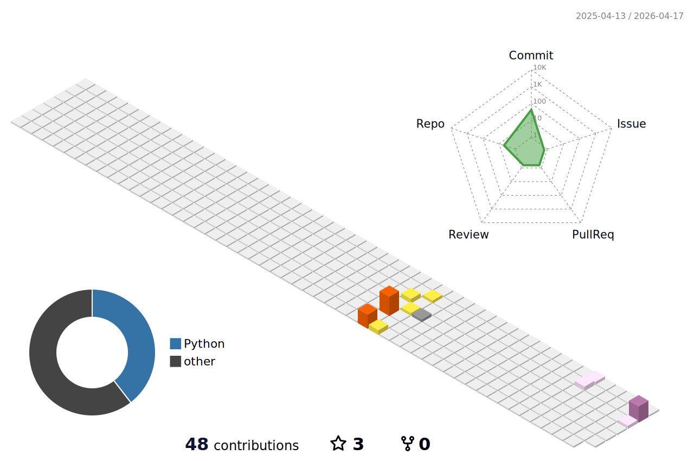

# Hello! My name is Daniel Collado

**FULL STACK DEVELOPER SPECIALIZING IN PYTHON** 💻 

Focused on the integration of web services, automation with Python, and artificial intelligence solutions applied to R&D and open data environments.

## Contact

## ⚡ Most used technologies

### 🚀 Languages

### 🧩 Libraries & Frameworks

### 📘 Others...

## 📈 Working on...

